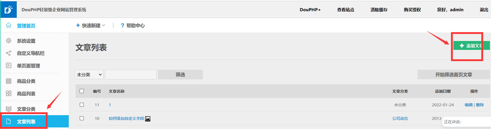

# douphp
XSS vulnerability exists in douphp background adding articles.

Official demo site, administrator login.
https://demo.douphp.com/admin/login.php

Source download address.
https://down.douphp.com/DouPHP_1.6_Release_20220121.zip

Log in to the background and add articles.

Insert XSS code at the article name,Submit.

Cookie pops up in the background.

The foreground will also trigger vulnerabilities.

